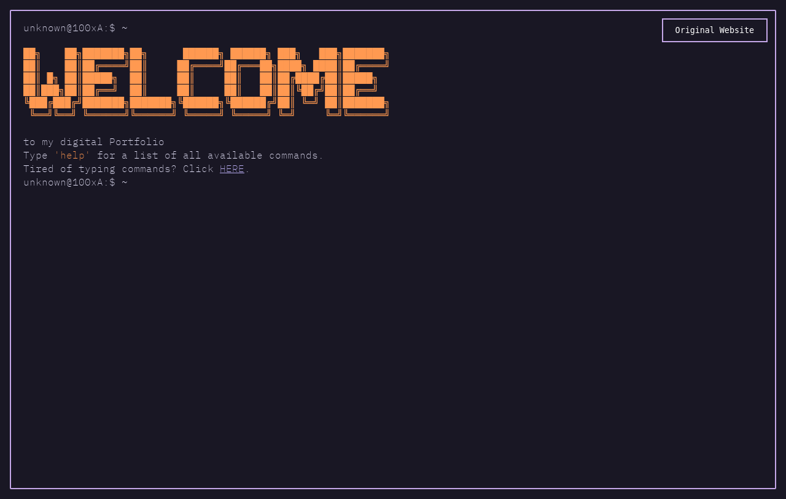

# My Terminal Portfolio

Built upon on: https://github.com/nasan016/webshell?tab=readme-ov-file



Check out the current running website on:
https://100xa.netlify.app/

### Features

- **[Tab]** for auto completion
- **[Esc]** to clear the input line
- **[↑][↓]** to scroll through your command history

### Configuration

Configuration for welcome message/colors/socials is done in the `config.json` file:

```json
{
  "ascii": [
    "██╗    ██╗███████╗██╗      ██████╗ ██████╗ ███╗   ███╗███████╗",
    "██║    ██║██╔════╝██║     ██╔════╝██╔═══██╗████╗ ████║██╔════╝",
    "██║ █╗ ██║█████╗  ██║     ██║     ██║   ██║██╔████╔██║█████╗",
    "██║███╗██║██╔══╝  ██║     ██║     ██║   ██║██║╚██╔╝██║██╔══╝",
    "╚███╔███╔╝███████╗███████╗╚██████╗╚██████╔╝██║ ╚═╝ ██║███████╗",
    " ╚══╝╚══╝ ╚══════╝╚══════╝ ╚═════╝ ╚═════╝ ╚═╝     ╚═╝╚══════╝"
  ],
  "title": "Portfolio",
  "original": "https://100xa.github.io/",
  "social": {
    "email": "biernackijan4@gmail.com",
    "github": "100xA",
    "linkedin": "www.linkedin.com/in/jan-biernacki-934221200/"
  },
  "colors": {
    "background": "#232136",
    "foreground": "#e0def4",
    "banner": "#FF9951",
    "border": {
      "visible": false,
      "color": "#FFADE2"
    },
    "prompt": {
      "default": "#A5A7A7",
      "user": "#FE6BC9",
      "host": "#f6c177",
      "input": "#FF7685"
    },
    "link": {
      "text": "#B6AAEE",
      "highlightColor": "#FFADE2",
      "highlightText": "#0C0623"
    },
    "commands": {
      "textColor": "#c4a7e7"
    }
  }
}
```

Other configurations are made in the objects of each command files.

### Running the project

1. Clone the repository

```
git clone https://github.com/100xA/100xA-Terminal.git
```

2. Go to the project directory

```
cd webshell
```

3. Install the dependencies

```
npm install
```

4. Start the server

```
npm run dev
```
